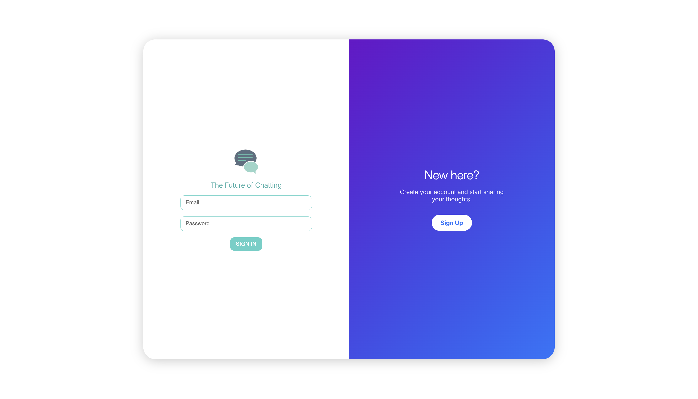

# Chat App

### Local setup
- ### 1. Make sure you have Node installed. Currently using `Node v22.14.0`
    - ### https://github.com/nvm-sh/nvm
    - ### https://formulae.brew.sh/formula/nvm

- ### 2. In root directory
```
npm i
```

- ### 3. Create a file called 'default.json' for local environment in the folder `backend/config`
```
{
  "VARS": {
    "postgres_host": "localhost",
    "postgres_db_name": "chat_app",
    "postgres_user": "",
    "postgres_password": "",
    "jwt_key": "put-a-secret-here",
    "jwt_expiration": "5h"
  }
}
```

- ### 4. Follow the steps described in `postgres/README.md`

- ### 4. `cd` into `frontend` and run...
```
npm run local
```

- ### 5. Open a new terminal

- ### 6. `cd` into `backend` and run...
```
npm run local
```


<br>

---

### 🖼️ Screenshots (from the app)

#### 🔐 Authentication Page  


#### 💬 Main App Interface  


---

